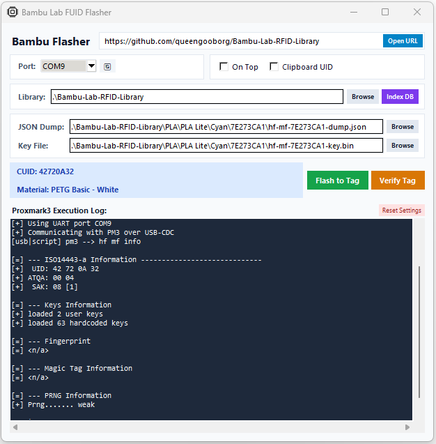

# Bambu Lab FUID Flasher

A modern, clean Python/Tkinter graphical user interface (GUI) designed to streamline flashing and verifying Bambu Lab RFID tags using a Proxmark3 device.

## Application Preview

## Features
* **Tag Flashing & Verification:** Easily execute `hf mf restore` and `hf mf info` commands through an intuitive GUI.
* **Download and create Library Indexing:** Index local Bambu Lab RFID tag dumps and automatically match scanned tags to their specific material and color.
* **Clipboard Integration:** Automatically copies scanned CUIDs to the clipboard.
* **Modern UI:** Built with custom card layouts, dark-themed console logging, and responsive window scaling.
* **Auto-Configuration:** Persists user settings (COM port, library paths, options) across sessions via an `.ini` file.

## Getting Started & Usage Options
You can run this tool either directly from the source code or via the precompiled standalone executable:
1. **Python Source Code (`.py`):** Requires Python 3.8+ and `pyserial` (`pip install pyserial`).
2. **Precompiled Executable (`.exe`):** A precompiled build is available that comes with all dependencies ready to use out of the box. 

To use either version successfully, you only need to provide:
* **Proxmark3 Easy:** This program is designed to work seamlessly with the **Proxmark3 Easy**.
* **Proxmark3 & Libs:** Get precompiled builds for Proxmark3 from [Proxmark3 Builds](https://www.proxmarkbuilds.org/) and place `proxmark3.exe` along with your `libs/` folder in the program's root directory.

## Compile or run
Run program from CMD:
python bambulab_flasher.py

Compile program:
pyinstaller --onefile --noconsole --hidden-import="serial.tools.list_ports" --icon="fuid.ico" --add-data "fuid.ico;." bambulab_flasher.py
